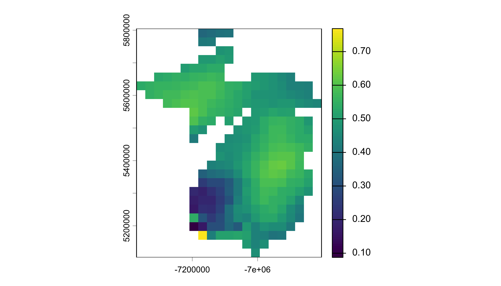
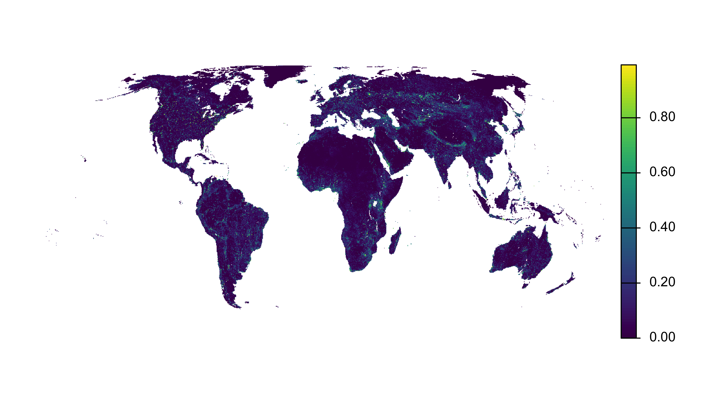

# Introduction to eBird Status Data Products

## Background

The study and conservation of the natural world relies on detailed
information about the distributions, abundances, and population trends
of species over time. For many taxa, this information is challenging to
obtain at relevant geographic scales. The goal of the eBird Status and
Trends project is to use data from [eBird](https://ebird.org/home), the
global community science bird monitoring program administered by The
Cornell Lab of Ornithology, to generate a reliable, standardized source
of biodiversity information for the world’s bird populations. To
translate the eBird observations into robust data products, we use
machine learning to fill spatiotemporal gaps, using local land cover
descriptions derived from remote sensing data, while controlling for
biases inherent in species observations collected by community
scientists. See Fink et al. (2019) for more information about the
analysis used to generate these data.

This vignette gives an overview of the eBird Status Data Products, which
estimate the full annual cycle distributions, relative abundances, and
habitat associations for 2,980 species for the year 2023. For each
species, distribution and abundance estimates are available for all 52
weeks of the year across a regular 3 km by 3 km square grid of cells
covering the globe. Variation in detectability associated with the
search effort is controlled by standardizing the estimates as the
expected occurrence rate and count of the species on a 1 hour, 2 km
checklist by an expert eBird observer at the optimal time of day and
with optimal weather conditions for detecting the species.

## Data access

Data access is granted through an Access Request Form at:
<https://ebird.org/st/request>. Filling out this form generates a key to
be used with this R package. Our terms of use have been designed to be
quite permissive in many cases, particularly academic and research use.
When requesting data access, please be sure to carefully read the terms
of use and ensure that your intended use is not restricted.

After completing the Access Request Form, you will be provided an eBird
Status and Trends Data Products access key, which you will need when
downloading data. To store the key so this package can access it when
downloading data, use the function `set_ebirdst_access_key("XXXXX")`,
where `"XXXXX"` is the access key provided to you.

There are a wide variety of data products available for download with
`ebirdst` via the function
[`ebirdst_download_status()`](https://ebird.github.io/ebirdst/reference/ebirdst_download_status.md).
The first argument to this function defines the species (as a common
name, scientific name, or species code) to download data for and the
remaining arguments define the specific data products to download.
Throughout this vignettes, we’ll use a simplified example dataset
consisting of estimates for Yellow-bellied Sapsucker in Michigan. This
dataset is designed to be small for faster download and is accessible
without a key. By default `ebirst_download_status()` only downloads the
most commonly used data products; however, since this vignette will
cover all the available data products, we’ll use `download_all = TRUE`.
Note that data for any species other that the example dataset requires a
key to access.

``` r
library(dplyr)
library(sf)
library(terra)
library(ebirdst)

# download a simplified example dataset for Yellow-bellied Sapsucker in Michigan
ebirdst_download_status(species = "yebsap-example", download_all = TRUE)
```

By default,
[`ebirdst_download_status()`](https://ebird.github.io/ebirdst/reference/ebirdst_download_status.md)
downloads data to a centralized directory for on your computer. You can
see what that directory is with the function
[`ebirdst_data_dir()`](https://ebird.github.io/ebirdst/reference/ebirdst_data_dir.md)
and you can change the default download directory by setting the
environment variable `EBIRDST_DATA_DIR`, for example by calling
[`usethis::edit_r_environ()`](https://usethis.r-lib.org/reference/edit.html)
and adding a line such as
`EBIRDST_DATA_DIR=/custom/download/directory/`.

**IMPORTANT: eBird Status and Trends Data Products are designed to be
downloaded and accessed using the `ebirdst` R package. Data downloaded
using this R package have a specific file structure and changing file
names or locations will disrupt the ability of functions in this package
to access the data. If you prefer to access data for use outside of R,
consider downloading data via the [eBird Status and Trends
website](https://science.ebird.org/en/status-and-trends/download-data).**

### Managing downloaded data

Because a new version of the data products is released each year, data
for multiple versions can accumulate on disk over time. Use
[`ebirdst_data_inventory()`](https://ebird.github.io/ebirdst/reference/ebirdst_data_inventory.md)
to get a summary of all data currently downloaded, with separate rows
for the Status and Trends data products for each species.

``` r
ebirdst_data_inventory()
#> eBird Status and Trends data: 51 species, 61 packages (6.1 GB)
#> 
#> 2022 Trends Data Products (53.1 MB)
#>   Abert's Towhee (abetow): 3 files, 364.9 KB
#>   Brewer's Sparrow (brespa): 3 files, 4.0 MB
#>   Brown Pelican (brnpel): 3 files, 1.7 MB
#>   Black-throated Green Warbler (btnwar): 3 files, 7.1 MB
#>   Burrowing Owl (burowl): 3 files, 4.8 MB
#>   Grasshopper Sparrow (graspa): 3 files, 7.3 MB
#>   Limpkin (limpki): 3 files, 1.1 MB
#>   Marsh Wren (marwre): 3 files, 5.9 MB
#>   Prairie Warbler (prawar): 3 files, 3.3 MB
#>   Sagebrush Sparrow (sagspa1): 3 files, 2.5 MB
#>   Sage Thrasher (sagthr): 3 files, 2.7 MB
#>   Seaside Sparrow (seaspa): 3 files, 215.5 KB
#>   American Coot (y00475): 3 files, 12.2 MB
#> 
#> 2023 Status Data Products (6.0 GB)
#>   Abert's Towhee (abetow): 2 files, 2.4 MB
#>   Puerto Rican Mango (antman3): 4 files, 51.9 MB
#>   Asian House-Martin (ashmar1): 28 files, 233.7 MB
#>   Baird's Sparrow (baispa): 6 files, 61.5 MB
#>   Bank Swallow (banswa): 2 files, 19.4 MB
#>   Barn Swallow (barswa): 27 files, 1.2 GB
#>   Black-bellied Plover (bkbplo): 3 files, 9.3 MB
#>   Bobolink (boboli): 6 files, 103.5 MB
#>   Brown-headed Thrush (brhthr1): 47 files, 105.2 MB
#>   Brown Pelican (brnpel): 4 files, 68.7 MB
#>   Black-throated Green Warbler (btnwar): 4 files, 121.2 MB
#>   Burrowing Owl (burowl): 4 files, 415.9 MB
#>   Cerulean Warbler (cerwar): 3 files, 583.3 KB
#>   Chestnut-collared Longspur (chclon): 6 files, 86.0 MB
#>   Colima Warbler (colwar): 10 files, 4.0 MB
#>   Data Coverage (data_coverage): 3 files, 91.9 MB
#>   Golden Eagle (goleag): 28 files, 881.9 MB
#>   Grasshopper Sparrow (graspa): 4 files, 139.8 MB
#>   Horned Lark (horlar): 47 files, 741.7 MB
#>   Kentucky Warbler (kenwar): 5 files, 31.7 MB
#>   Limpkin (limpki): 4 files, 181.6 MB
#>   Little Ringed Plover (lirplo): 3 files, 25.6 MB
#>   Long-toed Stint (lotsti): 3 files, 4.9 MB
#>   Marsh Wren (marwre): 4 files, 85.5 MB
#>   Pectoral Sandpiper (pecsan): 2 files, 5.8 MB
#>   Pinyon Jay (pinjay): 2 files, 828.2 KB
#>   Prairie Warbler (prawar): 4 files, 87.1 MB
#>   Puerto Rican Owl (prsowl): 4 files, 51.9 MB
#>   Red Knot (redkno): 3 files, 4.2 MB
#>   Red-necked Stint (rensti): 3 files, 4.7 MB
#>   Rock Pigeon (rocpig): 7 files, 24.0 MB
#>   Ruby-throated Hummingbird (rthhum): 8 files, 81.6 MB
#>   Ruddy Turnstone (rudtur): 3 files, 8.0 MB
#>   Rufous Hummingbird (rufhum): 5 files, 27.3 MB
#>   Sandhill Crane (sancra): 4 files, 177.5 MB
#>   Seaside Sparrow (seaspa): 4 files, 53.0 MB
#>   Sprague's Pipit (sprpip): 6 files, 73.7 MB
#>   Surf Scoter (sursco): 2 files, 2.4 MB
#>   Taiwan Barwing (taibar1): 3 files, 837.4 KB
#>   Tree Swallow (treswa): 2 files, 7.7 MB
#>   Upland Sandpiper (uplsan): 6 files, 138.5 MB
#>   Western Meadowlark (wesmea): 8 files, 225.4 MB
#>   Western Tanager (westan): 5 files, 48.5 MB
#>   White-cheeked Pintail (whcpin): 4 files, 85.1 MB
#>   Whimbrel (whimbr): 4 files, 122.0 MB
#>   American Coot (y00475): 4 files, 85.6 MB
#>   Yellow-breasted Crake (yebcra1): 4 files, 61.0 MB
#>   Yellow-bellied Sapsucker (yebsap-example): 52 files, 9.9 MB
```

To remove data for specific species or version years, use
[`ebirdst_delete()`](https://ebird.github.io/ebirdst/reference/ebirdst_delete.md).
When called interactively it will display a summary of the data to be
removed and ask for confirmation before proceeding. To skip the prompt,
use `force = TRUE`.

``` r
# review and confirm before deleting
ebirdst_delete(species = "yebsap-example")

# delete all data for a given version year without prompting
ebirdst_delete(year = 2021, force = TRUE)
```

## Species list

The data frame `ebirdst_runs` lists all species with eBird Status Data
Products available for download.

``` r
glimpse(ebirdst_runs)
#> Rows: 2,981
#> Columns: 30
#> $ species_code                   <chr> "yebsap-example", "abetow", "absfin1", …
#> $ scientific_name                <chr> "Sphyrapicus varius", "Melozone aberti"…
#> $ common_name                    <chr> "Yellow-bellied Sapsucker", "Abert's To…
#> $ is_resident                    <lgl> FALSE, TRUE, TRUE, FALSE, TRUE, TRUE, F…
#> $ breeding_quality               <chr> "3", NA, NA, "3", NA, NA, "1", NA, NA, …
#> $ breeding_start                 <date> 2023-05-17, NA, NA, 2023-05-31, NA, NA…
#> $ breeding_end                   <date> 2023-08-16, NA, NA, 2023-08-02, NA, NA…
#> $ nonbreeding_quality            <chr> "3", NA, NA, "3", NA, NA, "1", NA, NA, …
#> $ nonbreeding_start              <date> 2023-11-22, NA, NA, 2023-11-22, NA, NA…
#> $ nonbreeding_end                <date> 2023-03-08, NA, NA, 2023-02-22, NA, NA…
#> $ postbreeding_migration_quality <chr> "3", NA, NA, "3", NA, NA, "0", NA, NA, …
#> $ postbreeding_migration_start   <date> 2023-08-23, NA, NA, 2023-08-09, NA, NA…
#> $ postbreeding_migration_end     <date> 2023-11-15, NA, NA, 2023-11-15, NA, NA…
#> $ prebreeding_migration_quality  <chr> "3", NA, NA, "3", NA, NA, "0", NA, NA, …
#> $ prebreeding_migration_start    <date> 2023-03-15, NA, NA, 2023-03-01, NA, NA…
#> $ prebreeding_migration_end      <date> 2023-05-10, NA, NA, 2023-05-24, NA, NA…
#> $ resident_quality               <chr> NA, "3", "3", NA, "3", "3", NA, "2", "3…
#> $ resident_start                 <date> NA, 2023-01-04, 2023-01-04, NA, 2023-0…
#> $ resident_end                   <date> NA, 2023-12-27, 2023-12-27, NA, 2023-1…
#> $ status_version_year            <dbl> 2023, 2023, 2023, 2023, 2023, 2023, 202…
#> $ has_trends                     <lgl> TRUE, TRUE, FALSE, TRUE, TRUE, FALSE, F…
#> $ trends_season                  <chr> "breeding", "resident", NA, "breeding",…
#> $ trends_region                  <chr> "north_america", "north_america", NA, "…
#> $ trends_start_year              <dbl> 2012, 2012, NA, 2012, 2011, NA, NA, NA,…
#> $ trends_end_year                <dbl> 2022, 2022, NA, 2022, 2021, NA, NA, NA,…
#> $ trends_start_date              <chr> "05-24", "01-25", NA, "05-24", "11-01",…
#> $ trends_end_date                <chr> "08-16", "05-10", NA, "08-02", "05-03",…
#> $ rsquared                       <dbl> 0.8572896, 0.9231821, NA, 0.8570363, 0.…
#> $ beta0                          <dbl> 0.227000849, -0.013923012, NA, 0.689424…
#> $ trends_version_year            <dbl> 2022, 2022, NA, 2022, 2022, NA, NA, NA,…
```

If you’re working in RStudio, you can use
[`View()`](https://rdrr.io/r/utils/View.html) to interactively explore
this data frame.

All species go through a process of review by an expert on that species
prior to being released. The `ebirdst_runs` data frame contains
information from this review process. For migrants, reviewers assess the
model estimates for each of the four seasons: breeding, non-breeding,
pre-breeding migration, and post-breeding migration. Resident (i.e.,
non-migratory) species are identified by having `TRUE` in the
`is_resident` column of `ebirdst_runs`, and these species are assessed
across the whole year rather than seasonally. `ebirdst_runs` contains
two important pieces of information for each season: a **quality**
rating and **seasonal dates**.

The **seasonal dates** define the weeks that fall within each season.
Breeding and non-breeding season dates are defined for each species as
the weeks during those seasons when the species’ population does not
move. For this reason, these seasons are also described as stationary
periods. Migration periods are defined as the periods of movement
between the stationary non-breeding and breeding seasons. Note that for
many species these migratory periods include not only movement from
breeding grounds to non-breeding grounds, but also post-breeding
dispersal, molt migration, and other movements.

Reviewers also examine the model estimates for each season to assess the
amount of extrapolation or omission present in the model, and assign an
associated quality rating ranging from 0 (lowest quality) to 3 (highest
quality). Extrapolation refers to cases where the model predicts
occurrence where the species is known to be absent, while omission
refers to the model failing to predict occurrence where a species is
known to be present.

A rating of 0 implies this season failed review and model results should
not be used at all for this period. Ratings of 1-3 correspond to a
gradient of more to less extrapolation and/or omission, and we often use
a traffic light analogy when referring to them:

1.  **Red light (1)**: low quality, extensive extrapolation and/or
    omission and noise, but at least some regions have estimates that
    are accurate; can be used with caution in certain regions.
2.  **Yellow light (2)**: medium quality, some extrapolation and/or
    omission; use with caution.
3.  **Green light (3)**: high quality, very little or no extrapolation
    and/or omission; these seasons can be safely used.

Let’s look at the results of the review for our example dataset.

``` r
ebirdst_runs |> 
  filter(species_code == "yebsap-example") |> 
  glimpse()
#> Rows: 1
#> Columns: 30
#> $ species_code                   <chr> "yebsap-example"
#> $ scientific_name                <chr> "Sphyrapicus varius"
#> $ common_name                    <chr> "Yellow-bellied Sapsucker"
#> $ is_resident                    <lgl> FALSE
#> $ breeding_quality               <chr> "3"
#> $ breeding_start                 <date> 2023-05-17
#> $ breeding_end                   <date> 2023-08-16
#> $ nonbreeding_quality            <chr> "3"
#> $ nonbreeding_start              <date> 2023-11-22
#> $ nonbreeding_end                <date> 2023-03-08
#> $ postbreeding_migration_quality <chr> "3"
#> $ postbreeding_migration_start   <date> 2023-08-23
#> $ postbreeding_migration_end     <date> 2023-11-15
#> $ prebreeding_migration_quality  <chr> "3"
#> $ prebreeding_migration_start    <date> 2023-03-15
#> $ prebreeding_migration_end      <date> 2023-05-10
#> $ resident_quality               <chr> NA
#> $ resident_start                 <date> NA
#> $ resident_end                   <date> NA
#> $ status_version_year            <dbl> 2023
#> $ has_trends                     <lgl> TRUE
#> $ trends_season                  <chr> "breeding"
#> $ trends_region                  <chr> "north_america"
#> $ trends_start_year              <dbl> 2012
#> $ trends_end_year                <dbl> 2022
#> $ trends_start_date              <chr> "05-24"
#> $ trends_end_date                <chr> "08-16"
#> $ rsquared                       <dbl> 0.8572896
#> $ beta0                          <dbl> 0.2270008
#> $ trends_version_year            <dbl> 2022
```

From this, we can see that Yellow-bellied Sapsucker was modeled as a
migrant and all four seasons received a quality of 3, the highest
rating. Note that there are a variety of trends-specific columns at the
end of this data frame that we’ll ignore for now; these columns will be
covered in the [trends
vignette](https://ebird.github.io/ebirdst/articles/trends.html)

## Data types

For each species, there are a variety of data products available, which
can be categorized into the following broad types:

- **Weekly raster estimates:** weekly estimates of occurrence, count,
  relative abundance, and proportion of population on a regular grid in
  GeoTIFF format at three resolutions. These are the core products from
  which the other products are derived.
- **Seasonal raster estimates:** seasonal estimates of occurrence,
  count, relative abundance, and proportion of population on a regular
  grid in GeoTIFF format at three resolutions. These are derived from
  the corresponding weekly raster data by summarizing across the weeks
  falling within each season based on the dates defined in the
  `ebirdst_runs` data frame. Only seasons that passed the expert review
  process are included.
- **Seasonal range boundaries:** seasonal range boundary polygons in
  GeoPackage format.
- **Regional summary statistics:** a variety of summary statistics for
  countries and states/provinces (e.g. proportion of total population in
  the region) in CSV format.
- **Predictive performance metrics (PPMs):** a suite of spatial
  predictive performance metrics on a regular 27 km by 27 km grid in
  GeoTIFF format.

Each of these data products will be covered in more detail in the
following sections, including details on how to load the data into R.
All of the loading functions take a species (given as common name,
scientific name, or species code) as their first argument. If you have
used a non-default `path` argument to
[`ebirdst_download_status()`](https://ebird.github.io/ebirdst/reference/ebirdst_download_status.md)
then you will also need to provide the same `path` argument to the
loading functions.

### Weekly raster estimates

The core raster data products are the weekly estimates of occurrence,
count, and relative abundance. These estimates are derived from an
ensemble model producing 100 individual estimates of the expected value
of each quantity. The raster data products give the median value across
the ensemble for each quantity.

The weekly estimates are all stored in the widely used GeoTIFF raster
format, and we refer to them as “weekly cubes” (e.g. the “weekly
abundance cube”). All cubes have 52 weeks and cover the entire globe,
even for species with ranges only covering a small region. They come
with areas of predicted and assumed zeroes, such that any cells that are
`NA` represent areas where we didn’t produce model estimates.

All estimates are the ensemble median expected value for a 2 km, 1 hour
eBird Traveling Count by an expert eBird observer at the optimal time of
day and for optimal weather conditions to observe the given species.

- **Occurrence**: the expected probability of encountering a species.
- **Count**: the expected count of a species, conditional on its
  occurrence at the given location.
- **Relative abundance**: the expected relative abundance of a species,
  computed as the product of the probability of occurrence and the count
  conditional on occurrence. In addition to the median relative
  abundance, upper and lower confidence intervals (CIs) are provided,
  defined at the 10th and 90th quantile of relative abundance,
  respectively.
- **Proportion of population**: the proportion of the total relative
  abundance within each cell. This is a derived product calculated by
  dividing each cell value in the relative abundance raster by the sum
  of all cell values

All predictions are made on a standard 3 km by 3 km global grid;
however, for convenience lower resolution GeoTIFFs are also provided,
which are typically much faster to work with. However, note that to keep
file sizes small, **the example dataset only contains lowest (27 km)
resolution data**. The three resolutions are:

- High resolution (3km): the native 3 km resolution data.
- Medium resolution (9km): the 3 km resolution data aggregated by a
  factor of 3 in each direction resulting in a resolution of 9 km.
- Low resolution (27km): the 3 km resolution data aggregated by a factor
  of 9 in each direction resulting in a resolution of 27 km.

The function
[`load_raster()`](https://ebird.github.io/ebirdst/reference/load_raster.md)
is used to load these data into R and takes arguments for `product` and
`resolution`. The `metric` argument can be also be used to access the
relative abundance CIs. All raster products are loaded into R as
`SpatRaster` objects for use with the `terra` R package. For example,

``` r
# weekly, 27km res, median relative abundance
abd_lr <- load_raster("yebsap-example", product = "abundance", 
                      resolution = "27km")

# weekly, 27km res, median proportion of population
prop_pop_lr <- load_raster("yebsap-example", product = "proportion-population", 
                      resolution = "27km")

# weekly, 27km res, abundance confidence intervals
abd_lower <- load_raster("yebsap-example", product = "abundance", metric = "lower", 
                         resolution = "27km")
abd_upper <- load_raster("yebsap-example", product = "abundance", metric = "upper", 
                         resolution = "27km")
```

Each object has 52 layers, one for each week of the year, and layer
names store the dates corresponding to the midpoints of each week.

``` r
as.Date(names(abd_lr))
#>  [1] "2023-01-04" "2023-01-11" "2023-01-18" "2023-01-25" "2023-02-01"
#>  [6] "2023-02-08" "2023-02-15" "2023-02-22" "2023-03-01" "2023-03-08"
#> [11] "2023-03-15" "2023-03-22" "2023-03-29" "2023-04-05" "2023-04-12"
#> [16] "2023-04-19" "2023-04-26" "2023-05-03" "2023-05-10" "2023-05-17"
#> [21] "2023-05-24" "2023-05-31" "2023-06-07" "2023-06-14" "2023-06-21"
#> [26] "2023-06-28" "2023-07-05" "2023-07-12" "2023-07-19" "2023-07-26"
#> [31] "2023-08-02" "2023-08-09" "2023-08-16" "2023-08-23" "2023-08-30"
#> [36] "2023-09-06" "2023-09-13" "2023-09-20" "2023-09-27" "2023-10-04"
#> [41] "2023-10-11" "2023-10-18" "2023-10-25" "2023-11-01" "2023-11-08"
#> [46] "2023-11-15" "2023-11-22" "2023-11-29" "2023-12-06" "2023-12-13"
#> [51] "2023-12-20" "2023-12-27"
```

The GeoTIFFs use the [Equal
Earth](https://en.wikipedia.org/wiki/Equal_Earth_projection) coordinate
reference system, an equal area projection suitable for global mapping
and analysis.

### Seasonal raster estimates

The seasonal raster estimates are provided for the same set of products
and at the same three resolutions as the weekly estimates. They’re
derived from the weekly data by taking the cell-wise mean or max across
the weeks within each season. The seasonal boundary dates are defined
through a process of expert review of each species, and are available in
the data frame `ebirdst_runs`. Each season is also given a quality score
from 0 (fail) to 3 (high quality), and seasons with a score of 0 are not
provided.

The function `load_raster(period = "seasonal")` is used to load these
data into R and takes arguments for `product`, `metric` and
`resolution`. The data are loaded into R as `SpatRaster` objects for use
with the `terra` package. For example,

``` r
# seasonal, 27km res, mean relative abundance
abd_seasonal_mean <- load_raster("yebsap-example", product = "abundance", 
                                 period = "seasonal", metric = "mean", 
                                 resolution = "27km")
# season that each layer corresponds to
names(abd_seasonal_mean)
#> [1] "breeding"               "nonbreeding"            "prebreeding_migration" 
#> [4] "postbreeding_migration"
# just the breeding season layer
abd_seasonal_mean[["breeding"]]
#> class       : SpatRaster 
#> size        : 618, 1276, 1  (nrow, ncol, nlyr)
#> resolution  : 27000, 27000  (x, y)
#> extent      : -17226000, 17226000, -8343000, 8343000  (xmin, xmax, ymin, ymax)
#> coord. ref. : WGS 84 / Equal Earth Greenwich (EPSG:8857) 
#> source      : yebsap-example_abundance_seasonal_mean_27km_2023.tif 
#> name        : breeding 
#> min value   : 0.000000 
#> max value   : 1.021968

# seasonal, 27km res, max occurrence
occ_seasonal_max <- load_raster("yebsap-example", product = "occurrence", 
                                period = "seasonal", metric = "max", 
                                resolution = "27km")
```

Finally, as a convenience, the data products include year-round rasters
summarizing the mean or max across all weeks that fall within a season
that passed the expert review process. These can be accessed similarly
to the seasonal products, but with `period = "full-year"` instead. For
example, these layers can be used in conservation planning to assess the
most important sites across the full range and full annual cycle of a
species.

``` r
# full year, 27km res, maximum relative abundance
abd_fy_max <- load_raster("yebsap-example", product = "abundance", 
                          period = "full-year", metric = "max", 
                          resolution = "27km")
```

### Range boundaries

Seasonal range polygons are defined as the boundaries of non-zero
seasonal relative abundance estimates, which are then (optionally)
smoothed to produce more aesthetically pleasing polygons using the
`smoothr` package. They are provided in the widely used GeoPackage
format and can be loaded into R with
[`load_ranges()`](https://ebird.github.io/ebirdst/reference/load_ranges.md),
which returns a set of spatial features for use with the `sf` R package.
By default the smoothed ranges are returned, but using
`smoothed = FALSE` will return the raw, unsmoothed range polygons. Note
that only low and medium resolution ranges are provided. These range
polygons can be loaded with
[`load_ranges()`](https://ebird.github.io/ebirdst/reference/load_ranges.md):

``` r
# seasonal, 27km res, smoothed ranges
ranges <- load_ranges("yebsap-example", resolution = "27km")
ranges
#> Simple feature collection with 4 features and 8 fields
#> Geometry type: MULTIPOLYGON
#> Dimension:     XY
#> Bounding box:  xmin: -90.41254 ymin: 41.69681 xmax: -82.4146 ymax: 48.19076
#> Geodetic CRS:  WGS 84
#> # A tibble: 4 × 9
#>   species_code scientific_name    common_name       prediction_year type  season
#>   <chr>        <chr>              <chr>                       <int> <chr> <chr> 
#> 1 yebsap       Sphyrapicus varius Yellow-bellied S…            2023 range breed…
#> 2 yebsap       Sphyrapicus varius Yellow-bellied S…            2023 range nonbr…
#> 3 yebsap       Sphyrapicus varius Yellow-bellied S…            2023 range postb…
#> 4 yebsap       Sphyrapicus varius Yellow-bellied S…            2023 range prebr…
#> # ℹ 3 more variables: start_date <date>, end_date <date>,
#> #   geom <MULTIPOLYGON [°]>

# subset to just the breeding season range using dplyr
range_breeding <- filter(ranges, season == "breeding")
```

### Regional summary statistics

Regional summaries of the seasonal raster estimates are also provided
for a standard set of regions (countries and states/provinces). These
summary statistics can be loaded with
[`load_regional_stats()`](https://ebird.github.io/ebirdst/reference/load_regional_stats.md):

``` r
regional <- load_regional_stats("yebsap-example")
glimpse(regional)
#> Rows: 8
#> Columns: 15
#> $ species_code           <chr> "yebsap-example", "yebsap-example", "yebsap-exa…
#> $ region_type            <chr> "country", "country", "country", "country", "st…
#> $ region_code            <chr> "USA", "USA", "USA", "USA", "USA-MI", "USA-MI",…
#> $ region_name            <chr> "United States", "United States", "United State…
#> $ continent_code         <chr> "NA", "NA", "NA", "NA", "NA", "NA", "NA", "NA"
#> $ continent_name         <chr> "North America", "North America", "North Americ…
#> $ season                 <chr> "breeding", "nonbreeding", "postbreeding_migrat…
#> $ abundance_mean         <dbl> 0.114652605, 0.123534772, 0.073477334, 0.084178…
#> $ total_pop_percent      <dbl> 0.3034155366, 0.9497140025, 0.7885750146, 0.435…
#> $ continent_pop_percent  <dbl> 0.3034155366, 0.9497140025, 0.7885750146, 0.435…
#> $ range_occupied_percent <dbl> 0.25990556, 0.40518814, 0.54434548, 0.49810429,…
#> $ range_total_percent    <dbl> 0.231714761, 0.801986186, 0.720437099, 0.573623…
#> $ range_days_occupation  <int> 98, 112, 91, 63, 98, 112, 91, 49
#> $ max_week               <chr> "2023-08-16", "2023-11-22", "2023-10-18", "2023…
#> $ max_week_percent_pop   <dbl> 0.4100934563, 0.9638256049, 0.9979910064, 0.985…
```

The six summary statistics are defined as:

- `abundance_mean`: mean relative abundance in the region.
- `total_pop_percent`: the proportion of the seasonal modeled population
  within the region.
- `continent_pop_percent`: the proportion of the seasonal modeled
  population for the continent within the region. The `continent_name`
  column identifies the continent that the region falls within. Note
  that Yellow-bellied Sapsucker only occurs in North American so the
  total and continental proportions are identical.
- `range_percent_occupied`: the proportion of the region occupied by the
  species during the given season.
- `range_total_percent`: the proportion of the species seasonal range
  falling within the region.
- `range_days_occupation`: number of days of the season that the region
  was occupied by this species.

### Predictive performance metrics (PPMs)

A subset of 10% of the eBird observations is excluded from model
training to be used as a test set. For each submodel making up the eBird
Status model ensemble, model predictions are compared to actual
occurrence and count for a spatiotemporally subsampled version of the
test dataset to generate a suite of predictive performance metrics
(PPMs) at the base model level. These PPMs are then summarized across
the ensemble to a 27 km resolution raster grid, where the cell values
are the average across all models in the ensemble contributing to that
cell. For migrants, PPMs are provided at weekly temporal resolution, in
the form of a stack of 52 rasters for each metric, while for residents,
year round PPMs are provided in the form of a single raster for each
metric.

In total, nineteen predictive performance metrics are provided in four
categories. **Binary** PPMs compare the predicted presence/absence to
observed detection/non-detection for all test checklists.

- `binary_f1`: [F1-score](https://en.wikipedia.org/wiki/F-score).
- `binary_mcc`: [Matthews Correlation Coefficient
  (MCC)](https://en.wikipedia.org/wiki/Phi_coefficient).
- `binary_prevalence`: the observed detection probability after
  spatiotemporal subsampling.

**Occurrence** PPMs compare the predicted encounter rate with the
observed detection/non-detection for the subset of test checklists
within the predicted range boundary.

- `occ_bernoulli_dev`: the proportion of the Bernoulli deviance
  explained.
- `occ_bin_spearman`: test observations are binned by predicted
  encounter rate with bin widths of 0.05, then the mean observed
  prevalence and predicted encounter rate are calculated within bins.
  This metric is the Spearman’s rank correlation coefficient comparing
  the observed and predicted binned mean values.
- `occ_brier`: Brier score, i.e. the mean squared difference between
  predicted encounter rate and observed detection/non-detection.
- `occ_pr_auc`: [area on the precision-recall curve
  (PR-AUC)](https://doi.org/10.1111/2041-210X.13140)
- `occ_pr_auc_gt_prev`: the proportion of the ensemble for which the
  PR-AUC is greater than observed prevalence, which indicates that the
  model is performing better than random guessing.
- `occ_pr_auc_normalized`: the [PR-AUC
  normalized](https://icml.cc/2012/papers/349.pdf) to account for class
  imbalance so that a value of 0 represents performance equal to random
  guessing and a value of 1 represents perfect classification.

**Count** PPMs compare the predicted count with the observed count for
the subset of test checklists within the predicted range boundary and
where the species was detected.

- `count_log_pearson`: the Pearson correlation coefficient comparing the
  logarithm of the predicted count with the logarithm of the observed
  count.
- `count_mae`: mean absolute error (MAE).
- `count_poisson_dev`: the proportion of the Poisson deviance explained.
- `count_rmse`: route mean squared error (RMSE).
- `count_spearman`: Spearman’s rank correlation coefficient.

**Abundance** PPMs compare the predicted relative abundance with the
observed count for the full set of tests checklists.

- `abd_log_pearson`: Pearson correlation coefficient comparing the
  logarithm of the predicted relative abundance with the logarithm of
  the observed count.
- `abd_mae`: the mean absolute error (MAE).
- `abd_poisson_dev`: the proportion of the Poisson deviance explained.
- `abd_rmse`: root mean squared error (RMSE).
- `abd_spearman`: Spearman’s rank correlation coefficient.

The spatial PPMs can be loaded using `load_ppms()`. For example, to load
the normalized PR-AUC for the example dataset use.

``` r
pr_auc <- load_ppm("yebsap-example", ppm = "occ_pr_auc_normalized")
print(pr_auc)
#> class       : SpatRaster 
#> size        : 618, 1276, 52  (nrow, ncol, nlyr)
#> resolution  : 27000, 27000  (x, y)
#> extent      : -17226000, 17226000, -8343000, 8343000  (xmin, xmax, ymin, ymax)
#> coord. ref. : WGS 84 / Equal Earth Greenwich (EPSG:8857) 
#> source      : yebsap-example_ppm_occ-pr-auc-normalized_mean_27km_2023.tif 
#> names       :     01-04,      01-11,     01-18,     01-25,     02-01,      02-08, ... 
#> min values  : 0.1113430, 0.09812936, 0.0189133, 0.0189133, 0.0189133, 0.01403384, ... 
#> max values  : 0.7343874, 0.73438740, 0.7969337, 0.7969337, 1.0000000, 1.00000000, ...
```

Since Yellow-bellied Sapsucker is a migrant, there are 52 layers, one
for each week of the year, giving the mean PR-AUC for each 27 km by 27
km grid cell. We can produce a simple plot of PR-AUC for a week in the
middle of the year. Note that
[`trim()`](https://rspatial.github.io/terra/reference/trim.html) is used
to trim the global raster down to just show the area with data (the
state of Michigan in this example dataset).

``` r
plot(trim(pr_auc[[26]]))
```



See the [applications
vignette](https://ebird.github.io/ebirdst/articles/applications.html)
for a more detailed example of how to use the PPMs.

## Data coverage

In addition to the species-specific data products discussed above,
`ebirdst` provides access to two species agnostic data products from out
data coverage workflow. The data products in GeoTIFF format provide
weekly estimates on a regular 3 km by 3km grid of

1.  **Site selection probability:** the modeled probability (0-1) that a
    grid cell of a certain habitat configuration received an eBird
    checklist within that region and season.
2.  **Spatial coverage:** the fraction (0-1) of grid cells within that
    region and season that checklists for the given week.

These data products identify areas where the coverage of eBird data is
relatively high or low, which can be used to prioritize areas for
increased data collection. To download the data coverage data products
use:

``` r
ebirdst_download_data_coverage()
```

Then to load the data, for example, site selection probability for the
week of May 10, and make a map, use:

``` r
site_sel <- load_data_coverage("selection-probability", week = "05-10")
plot(site_sel, axes = FALSE)
```



## References

> Fink, D., T. Auer, A. Johnston, V. Ruiz‐Gutierrez, W.M. Hochachka, S.
> Kelling. 2019. Modeling avian full annual cycle distribution and
> population trends with citizen science data. Ecological Applications,
> 00(00):e02056. doi: 10.1002/eap.2056
