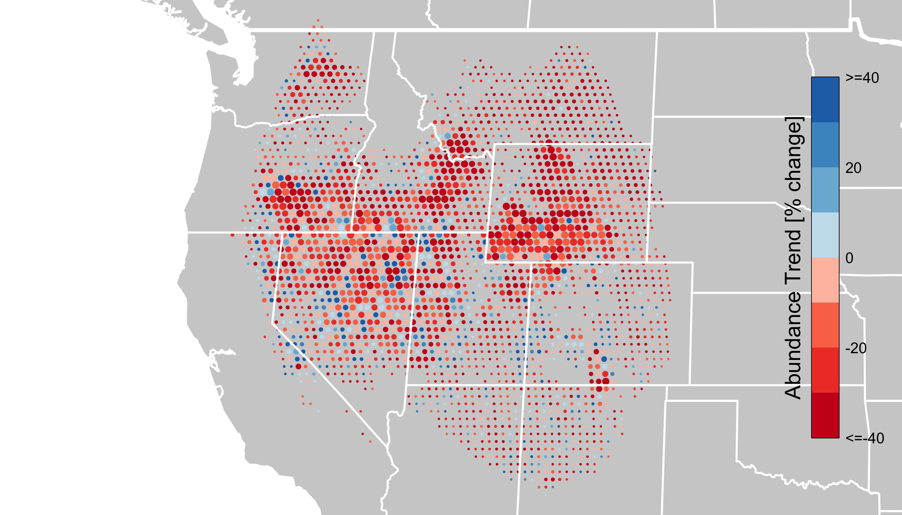
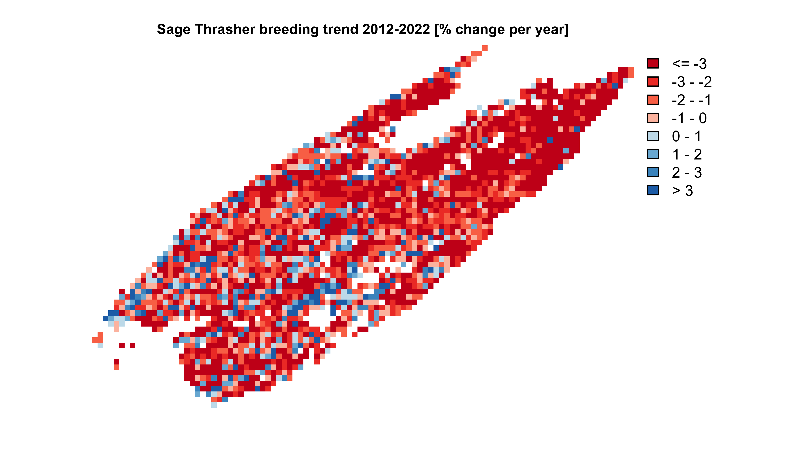
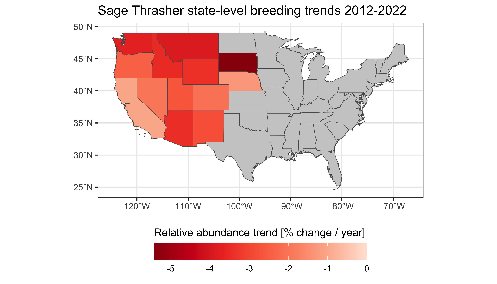
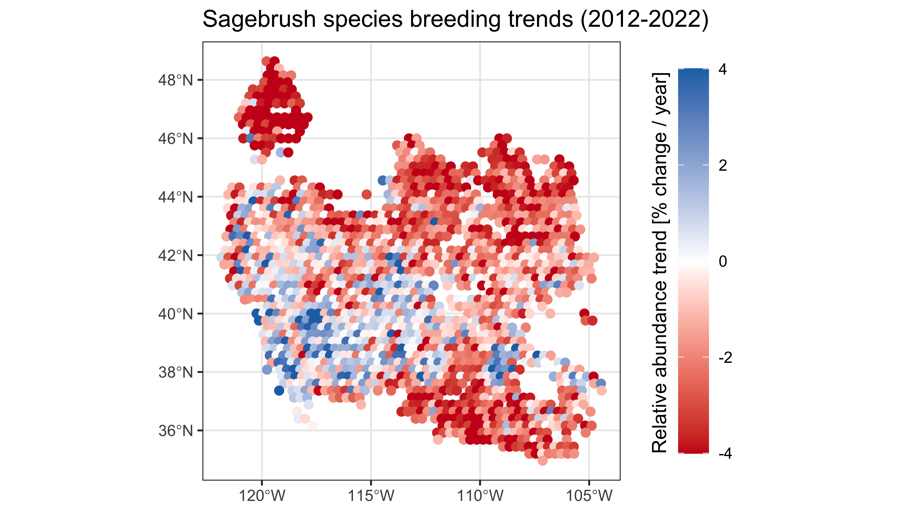

# eBird Trends Data Products

**Version Note:** In 2025, the eBird Status Data Products were updated
to the 2023 version year, however, none of the Trends data products were
updated. Therefore the Trends Data Products currently available via
`ebirdst` are for the 2022 prediction year.

The eBird Trends Data Products provide estimates of trends in relative
abundance based on eBird data. Trend estimates are made on a 27 km by 27
km grid for a single season per species (breeding, non-breeding, or
resident). For further details on the methodology used to estimate these
trends consult the associated paper:

> Fink, D., Johnston, A., Strimas-Mackey, M., Auer, T., Hochachka, W.
> M., Ligocki, S., Oldham Jaromczyk, L., Robinson, O., Wood, C.,
> Kelling, S., & Rodewald, A. D. (2023). A Double machine learning trend
> model for citizen science data. Methods in Ecology and Evolution, 00,
> 1–14. <https://doi.org/10.1111/2041-210X.14186>

Data users who are not comfortable in R should consider directly
downloading the data from the [eBird Status and Trends
website](https://science.ebird.org/en/status-and-trends/download-data).

The data frame `ebirdst_runs` indicates which species have trends
estimates with the `has_trends` column. We can filter the data frame and
only select those columns relevant to trends.

``` r
library(dplyr)
library(fields)
library(ggplot2)
library(rnaturalearth)
library(sf)
library(terra)
library(ebirdst)

trends_runs <- ebirdst_runs |> 
  filter(has_trends) |> 
  select(species_code, common_name,
         trends_season, trends_region,
         trends_start_year, trends_end_year,
         trends_start_date, trends_end_date,
         rsquared, beta0, trends_version_year)
glimpse(trends_runs)
#> Rows: 842
#> Columns: 11
#> $ species_code        <chr> "yebsap-example", "abetow", "acafly", "acowoo", "a…
#> $ common_name         <chr> "Yellow-bellied Sapsucker", "Abert's Towhee", "Aca…
#> $ trends_season       <chr> "breeding", "resident", "breeding", "resident", "b…
#> $ trends_region       <chr> "north_america", "north_america", "north_america",…
#> $ trends_start_year   <dbl> 2012, 2012, 2012, 2011, 2012, 2015, 2012, 2011, 20…
#> $ trends_end_year     <dbl> 2022, 2022, 2022, 2021, 2022, 2022, 2022, 2021, 20…
#> $ trends_start_date   <chr> "05-24", "01-25", "05-24", "11-01", "06-21", "07-2…
#> $ trends_end_date     <chr> "08-16", "05-10", "08-02", "05-03", "07-12", "12-0…
#> $ rsquared            <dbl> 0.8572896, 0.9231821, 0.8570363, 0.8805367, 0.7868…
#> $ beta0               <dbl> 0.227000849, -0.013923012, 0.689424792, -0.0926707…
#> $ trends_version_year <dbl> 2022, 2022, 2022, 2022, 2022, 2022, 2022, 2022, 20…
```

Information is provided on the trends model for each species, including
two predictive performance metrics (`rsquared` and `beta0`) that are
based on a comparison of actual and estimated trends for a suite of
simulations (see Fink et al. 2023 for further details). The columns in
the `trends_runs` data frame are as follows:

- `species_code`: the alphanumeric eBird species code uniquely
  identifying the species.
- `common_name`: the English common name of the species.
- `trends_season`: season that the trend was estimated for: breeding,
  non-breeding, or resident.
- `trends_region`: the geographic region that the trend model was run
  for. Note that broadly distributed species (e.g. Barn Swallow) will
  only have trend estimates for a regional subset of their full range.
- `trends_start_year/trends_end_year`: the start and end years of the
  trend time period.
- `trends_start_date/trends_end_date`: the start and end dates (`MM-DD`
  format) of the season for which the trend was estimated.
- `rsquared`: R-squared value comparing the actual and estimated trends
  from the simulations.
- `beta0`: the intercept of a linear model fitting actual vs. estimated
  trends (`actual ~ estimated`) for the simulations. Positive values of
  `beta0` indicate that the models are systematically *underestimating*
  the simulated trend for this species.
- `trends_version_year`: the version year for the trends data projects.

Note that some season dates span two calendar years, for example
Canvasback has 2011-2021 trends estimates for a non-breeding season
defined as December 20 to January 25. In this case, the first season
will be December 20, 2011 to January 25, 2012.

``` r
trends_runs |> 
  filter(common_name == "Canvasback") |> 
  select(trends_start_year, trends_end_year, 
         trends_start_date, trends_end_date)
#> # A tibble: 1 × 4
#>   trends_start_year trends_end_year trends_start_date trends_end_date
#>               <dbl>           <dbl> <chr>             <chr>          
#> 1              2011            2021 12-20             01-25
```

## Downloading data

Trends data access is granted through the same process as the eBird
Status Data Products. If you haven’t already requested an API key,
consult the relevant section in the [Introduction to eBird Status Data
Products
vignette](https://ebird.github.io/ebirdst/articles/status.html#access).

Trends data can be downloaded for one or more species using
[`ebirdst_download_trends()`](https://ebird.github.io/ebirdst/reference/ebirdst_download_trends.md),
where the first argument is a vector of common names, scientific names,
or species codes. As with the Status Data Products, trends data will be
downloaded to a centralized directory and file management and access is
performed via \`ebirdst. For example, let’s download the breeding season
trends data for Sage Thrasher.

``` r
ebirdst_download_trends("Sage Thrasher")
```

## Loading data into R

Once the data are downloaded, the trends data for a set of species, can
be loaded into R using the function
[`load_trends()`](https://ebird.github.io/ebirdst/reference/load_trends.md).
For example, we can load the Sage Thrasher trends estimates we just
downloaded with:

``` r
trends_sagthr <- load_trends("Sage Thrasher")
```

Each row corresponds to the trend estimate for a 27 km by 27 km grid
cell, identified by the `srd_id` column and with cell center given by
the `longitude` and `latitude` coordinates. Columns beginning with
`abd_ppy` provide estimates of the percent per year trend in relative
abundance and 80% confidence intervals, while those beginning with
`abd_trend` provide estimates of the cumulative trend in relative
abundance and 80% confidence intervals over the time period. The `abd`
column gives the relative abundance estimate for the middle of the trend
time period (e.g. 2014 for a 2007-2021 trend). The `start_year/end_year`
and `start_date/end_date` columns provide redundant information to that
available in `ebirdst_runs`. Specifically for Sage Thrasher we have:

``` r
trends_runs |> 
  filter(common_name == "Sage Thrasher") |> 
  select(trends_start_year, trends_end_year,
         trends_start_date, trends_end_date)
#> # A tibble: 1 × 4
#>   trends_start_year trends_end_year trends_start_date trends_end_date
#>               <dbl>           <dbl> <chr>             <chr>          
#> 1              2012            2022 05-17             07-12
```

This tells us that the trend estimates are for the breeding season (May
17 to July 12) for the period 2012-2022.

## Conversion to spatial formats

The eBird trends data are stored in a tabular format, where each row
gives the trend estimate for a single cell in a 27 km by 27 km equal
area grid. For each grid cell, the coordinates (longitude and latitude)
are provided for the center of the grid cell. For many applications, an
explicitly spatial format is more useful and these coordinates can be
use to convert from the tabular format to either a vector or raster
format.

### Vector (points)

The tabular trend data can be converted into point vector features for
use with the `sf` package using the `sf` function
[`st_as_sf()`](https://r-spatial.github.io/sf/reference/st_as_sf.html).

``` r
trends_sf <- st_as_sf(trends_sagthr, 
                      coords = c("longitude", "latitude"), 
                      crs = 4326)
print(trends_sf)
#> Simple feature collection with 2462 features and 15 fields
#> Geometry type: POINT
#> Dimension:     XY
#> Bounding box:  xmin: -122.1784 ymin: 33.5256 xmax: -102.975 ymax: 49.35282
#> Geodetic CRS:  WGS 84
#> # A tibble: 2,462 × 16
#>    species_code season   start_year end_year start_date end_date srd_id      abd
#>  * <chr>        <chr>         <int>    <int> <chr>      <chr>     <int>    <dbl>
#>  1 sagthr       breeding       2012     2022 05-17      07-12    254264 0.000527
#>  2 sagthr       breeding       2012     2022 05-17      07-12    255764 0.0147  
#>  3 sagthr       breeding       2012     2022 05-17      07-12    255765 0.000214
#>  4 sagthr       breeding       2012     2022 05-17      07-12    257264 0.00174 
#>  5 sagthr       breeding       2012     2022 05-17      07-12    257265 0.0132  
#>  6 sagthr       breeding       2012     2022 05-17      07-12    257266 0.00118 
#>  7 sagthr       breeding       2012     2022 05-17      07-12    258765 0.00335 
#>  8 sagthr       breeding       2012     2022 05-17      07-12    258766 0.0191  
#>  9 sagthr       breeding       2012     2022 05-17      07-12    258767 0.00511 
#> 10 sagthr       breeding       2012     2022 05-17      07-12    260264 0.000104
#> # ℹ 2,452 more rows
#> # ℹ 8 more variables: abd_ppy <dbl>, abd_ppy_lower <dbl>, abd_ppy_upper <dbl>,
#> #   abd_ppy_nonzero <lgl>, abd_trend <dbl>, abd_trend_lower <dbl>,
#> #   abd_trend_upper <dbl>, geometry <POINT [°]>
```

These points can then be exported to GeoPackage for use in a GIS such as
QGIS or ArcGIS with

``` r
# be sure to modify the path to the file to save the file to directory of 
# your choice on your hard drive
write_sf(trends_sf, "ebird-trends_sagthr_2022.gpkg",
         layer = "sagthr_trends")
```

### Vector (abundance-scaled circles)

To produce maps similar to those on the eBird Status and Trends website
the function
[`vectorize_trends()`](https://ebird.github.io/ebirdst/reference/vectorize_trends.md)
will convert the tabular trends into spatial circles with areas roughly
proportional to the relative abundance in each 27 km by 27 km cell. To
produce circles that arean’t skewed it’s important to provide the
coordinate reference system you intend to map the resulting trends in.
This will ideally be an equal area projection and in the example before
we’ve used the Equal Earth projection centered on North America.

``` r
trends_circles <- vectorize_trends(trends_sagthr,
                                   crs = "+proj=eqearth +lon_0=-96")
```

Next, we’ll assign colors based on the cumulative trend (`abd_trend`)
using the same breaks as is used on the website.

``` r
# define legend
max_trend <- ceiling(max(abs(trends_circles$abd_trend)))
legend_breaks <- seq(0, 40, by = 10)
legend_breaks[length(legend_breaks)] <- max_trend
legend_breaks <- c(-rev(legend_breaks), legend_breaks) |> unique()
legend_labels <- c("<=-40", -20, 0, 20, ">=40")
legend_colors <- ebirdst_palettes(length(legend_breaks) - 1, type = "trends")

# assign colors to circles
trends_circles <- trends_circles |> 
  mutate(color = cut(abd_trend, legend_breaks, labels = legend_colors) |> 
           as.character())
```

Finally, we can make a trends map for this species.

``` r
# natural earth boundaries
countries <- ne_countries(returnclass = "sf", continent = "North America") |> 
  st_geometry() |> 
  st_transform(st_crs(trends_circles))
states <- ne_states(iso_a2 = c("US", "CA", "MX")) |> 
  st_geometry() |> 
  st_transform(st_crs(trends_circles))

# set the plotting extent
plot(st_geometry(trends_circles), border = NA, col = NA)
# add basemap
plot(countries, col = "#cfcfcf", border = "#888888", add = TRUE)
# add trends
plot(st_geometry(trends_circles),
     col = trends_circles$color, border = NA,
     axes = FALSE, bty = "n", reset = FALSE, add = TRUE)
# add boundaries
lines(vect(countries), col = "#ffffff", lwd = 3)
lines(vect(states), col =  "#ffffff", lwd = 1.5, xpd = TRUE)

# add legend using the fields package
# label the bottom, middle, and top
label_breaks <- seq(0, 1, length.out = length(legend_breaks))
image.plot(zlim = c(0, 1), breaks = label_breaks, col = legend_colors,
           smallplot = c(0.90, 0.93, 0.15, 0.85),
           legend.only = TRUE,
           axis.args = list(at = c(0, 0.25, 0.5, 0.75, 1), 
                            labels = legend_labels,
                            col.axis = "black", fg = NA,
                            cex.axis = 0.7, lwd.ticks = 0,
                            line = -0.75),
           legend.args = list(text = "Abundance Trend [% change]",
                              side = 2, line = 0.25))
```



### Raster

The tabular trend estimates can most easily be converted to raster
format for use with the `terra` package using the function
[`rasterize_trends()`](https://ebird.github.io/ebirdst/reference/rasterize_trends.md).
Any of the columns in the trends data frame can be selected using the
`layers` argument and converted into layers in the resulting raster
object.

``` r
# rasterize the percent per year trend with confidence limits (default)
ppy_raster <- rasterize_trends(trends_sagthr)
print(ppy_raster)
#> class       : SpatRaster 
#> size        : 67, 100, 3  (nrow, ncol, nlyr)
#> resolution  : 26665.26, 26665.28  (x, y)
#> extent      : -10602273, -7935747, 3714548, 5501122  (xmin, xmax, ymin, ymax)
#> coord. ref. : +proj=sinu +lon_0=0 +x_0=0 +y_0=0 +R=6371007.181 +units=m +no_defs 
#> source(s)   : memory
#> names       :   abd_ppy, abd_ppy_lower, abd_ppy_upper 
#> min values  : -14.62142,     -17.52655,     -11.48219 
#> max values  :  13.62980,      11.74418,      15.77865
# rasterize the cumulative trend estimate
trends_raster <- rasterize_trends(trends_sagthr, layers = "abd_trend")
print(trends_raster)
#> class       : SpatRaster 
#> size        : 67, 100, 1  (nrow, ncol, nlyr)
#> resolution  : 26665.26, 26665.28  (x, y)
#> extent      : -10602273, -7935747, 3714548, 5501122  (xmin, xmax, ymin, ymax)
#> coord. ref. : +proj=sinu +lon_0=0 +x_0=0 +y_0=0 +R=6371007.181 +units=m +no_defs 
#> source(s)   : memory
#> name        : abd_trend 
#> min value   : -79.41793 
#> max value   : 258.85772
```

These raster objects can be exported to GeoTIFF files for use in a GIS
such as QGIS or ArcGIS with

``` r
writeRaster(trends_raster, filename = "ebird-trends_sagthr_2021.tif")
```

A simple map of these data can be produced from the raster data. For
example, we’ll make a map of percent per year change in relative
abundance for Sage Thrasher. Note that this is slightly different than
the trends maps on the Status and Trends website, which show the
cumulative trend rather than the annual trend.

``` r
# define breaks and palettes similar to those on status and trends website
breaks <- seq(-4, 4)
breaks[1] <- -Inf
breaks[length(breaks)] <- Inf
pal <- ebirdst_palettes(length(breaks) - 1, type = "trends")

# make a simple map
plot(ppy_raster[["abd_ppy"]], 
     col = pal, breaks =  breaks,
     main = "Sage Thrasher breeding trend 2012-2022 [% change per year]",
     cex.main = 0.75,
     axes = FALSE)
```



## Uncertainty

The model used to estimate trends produces an ensemble of 100 estimates
at each location, each based on a random subsample of eBird data. This
ensemble of estimates is used to quantify uncertainty in the trends
estimates. The estimated trend is the median across the ensemble, and
the 80% confidence intervals are the lower 10th and upper 90th
percentiles across the ensemble. Those wishing to access estimates from
the individual folds making up the ensemble can use
`fold_estimates = TRUE` when loading data. These fold-level estimates
can be used to quantify uncertainty, for example, when calculating the
trend for a given region. For example, let’s load the fold-level
estimates for Sage Thrasher:

``` r
trends_sagthr_folds <- load_trends("sagthr", fold_estimates = TRUE)
print(trends_sagthr_folds)
#> # A tibble: 246,200 × 8
#>    species_code season    fold srd_id latitude longitude      abd abd_ppy
#>    <chr>        <chr>    <dbl>  <int>    <dbl>     <dbl>    <dbl>   <dbl>
#>  1 sagthr       breeding     1 254264     49.4     -120. 0.000527  -3.11 
#>  2 sagthr       breeding     1 255764     49.1     -120. 0.0147    -2.97 
#>  3 sagthr       breeding     1 255765     49.1     -119. 0.000214  -2.25 
#>  4 sagthr       breeding     1 257264     48.9     -120. 0.00174   -4.53 
#>  5 sagthr       breeding     1 257265     48.9     -120. 0.0132    -3.86 
#>  6 sagthr       breeding     1 257266     48.9     -119. 0.00118   -4.04 
#>  7 sagthr       breeding     1 258765     48.6     -120. 0.00335   -3.08 
#>  8 sagthr       breeding     1 258766     48.6     -119. 0.0191    -0.459
#>  9 sagthr       breeding     1 258767     48.6     -119. 0.00511   -6.40 
#> 10 sagthr       breeding     1 260264     48.4     -120. 0.000104  -2.71 
#> # ℹ 246,190 more rows
```

This data frame is much more concise, only giving estimates of the
mid-point relative abundance and percent per year trend in relative
abundance for each of 100 folds for each grid cell.

### Regional trends

eBird trend estimates are made on a 27 km by 27 km grid, which allows
summarization over broader regions such as states or provinces. Since
the relative abundance of a species varies throughout its range, we need
to weight the mean trend calculation by relative abundance (`abd` in the
trends data frame). To quantify uncertainty in the regional trend, we
can use the fold-level data to produce 100 distinct estimates of the
regional trend, then calculate the median and 80% confidence intervals.
As an example, let’s calculate the state-level mean percent per year
trends in relative abundance for Sage Thrasher.

``` r
# boundaries of states in the united states
states <- ne_states(iso_a2 = "US", returnclass = "sf") |>
  filter(iso_a2 == "US", !postal %in% c("AK", "HI")) |>
  transmute(state = iso_3166_2)

# convert fold-level trends estimates to sf format
trends_sagthr_sf <-  st_as_sf(trends_sagthr_folds, 
                              coords = c("longitude", "latitude"), 
                              crs = 4326)

# attach state to the fold-level trends data
trends_sagthr_sf <- st_join(trends_sagthr_sf, states, left = FALSE)

# abundance-weighted average trend by region and fold
trends_states_folds <- trends_sagthr_sf |>
  st_drop_geometry() |>
  group_by(state, fold) |>
  summarize(abd_ppy = sum(abd * abd_ppy) / sum(abd),
            .groups = "drop")

# summarize across folds for each state
trends_states <- trends_states_folds |> 
  group_by(state) |>
  summarise(abd_ppy_median = median(abd_ppy, na.rm = TRUE),
            abd_ppy_lower = quantile(abd_ppy, 0.10, na.rm = TRUE),
            abd_ppy_upper = quantile(abd_ppy, 0.90, na.rm = TRUE),
            .groups = "drop") |> 
  arrange(abd_ppy_median)
```

We can join these state-level trends back to the state boundaries and
make a map with `ggplot2`.

``` r
trends_states_sf <- left_join(states, trends_states, by = "state")
ggplot(trends_states_sf) +
  geom_sf(aes(fill = abd_ppy_median)) +
  scale_fill_distiller(palette = "Reds", 
                       limits = c(NA, 0),
                       na.value = "grey80") +
  guides(fill = guide_colorbar(title.position = "top", barwidth = 15)) +
  labs(title = "Sage Thrasher state-level breeding trends 2012-2022",
       fill = "Relative abundance trend [% change / year]") +
  theme_bw() +
  theme(legend.position = "bottom")
```



Based on these data, Sage Thrasher populations appear to be in decline
throughout their entire range; however, some states (e.g. South Dakota)
are experiencing much steeper declines than others (e.g. California).

### Multi-species trends

In some cases, we may be interested in the trend for an entire community
of birds, which can be estimated by calculating the cell-wise mean trend
across a suite of species. For example, the eBird Trends Data Products
contain trend estimates for three species that breed in
[sagebrush](https://en.wikipedia.org/wiki/Sagebrush_steppe): Brewer’s
Sparrow, Sagebrush Sparrow, and Sage Thrasher. We can calculate an
average trend for this group of species, which will provide an estimate
of the trend in the sagebrush bird community. First let’s look at the
model information to ensure all species are modeled for the same region,
season, and range of years.

``` r
sagebrush_species <- c("Brewer's Sparrow", "Sagebrush Sparrow", "Sage Thrasher")
trends_runs |> 
  filter(common_name %in% sagebrush_species)
#> # A tibble: 3 × 11
#>   species_code common_name       trends_season trends_region trends_start_year
#>   <chr>        <chr>             <chr>         <chr>                     <dbl>
#> 1 brespa       Brewer's Sparrow  breeding      north_america              2012
#> 2 sagspa1      Sagebrush Sparrow breeding      north_america              2012
#> 3 sagthr       Sage Thrasher     breeding      north_america              2012
#> # ℹ 6 more variables: trends_end_year <dbl>, trends_start_date <chr>,
#> #   trends_end_date <chr>, rsquared <dbl>, beta0 <dbl>,
#> #   trends_version_year <dbl>
```

Everything looks good, so we can proceed to compare trends for these
species. Next we need to download the trends data for these species.
Note that since we’ve already downloaded the Sage Thrasher data above it
won’t be re-downloaded here.

``` r
ebirdst_download_trends(sagebrush_species)
```

Now we can load the trends and calculate the cell-wise mean.

``` r
trends_sagebrush_species <- load_trends(sagebrush_species)

# calculate mean trend for each cell
trends_sagebrush <- trends_sagebrush_species |> 
  group_by(srd_id, latitude, longitude) |> 
  summarize(n_species = n(),
            abd_ppy = mean(abd_ppy, na.rm = TRUE),
            .groups = "drop")
print(trends_sagebrush)
#> # A tibble: 3,265 × 5
#>    srd_id latitude longitude n_species abd_ppy
#>     <int>    <dbl>     <dbl>     <int>   <dbl>
#>  1 234764     52.5     -118.         1  -8.61 
#>  2 234765     52.5     -117.         1  -7.91 
#>  3 234766     52.5     -117.         1  -6.30 
#>  4 236265     52.2     -118.         1  -0.521
#>  5 236266     52.2     -117.         1  -6.90 
#>  6 236267     52.2     -117.         1  -6.56 
#>  7 236268     52.2     -116.         1  -5.27 
#>  8 237765     52.0     -118.         1  -5.89 
#>  9 237766     52.0     -117.         1  -5.68 
#> 10 237767     52.0     -117.         1  -9.76 
#> # ℹ 3,255 more rows
```

Finally, let’s make a map of these sagebrush trends, focusing only on
those cells where all three species occur.

``` r
# convert the points to sf format
all_species <- trends_sagebrush |> 
  filter(n_species == length(sagebrush_species)) |> 
  st_as_sf(coords = c("longitude", "latitude"),
           crs = 4326)

# make a map
ggplot(all_species) +
  geom_sf(aes(color = abd_ppy), size = 2) +
  scale_color_gradient2(low = "#CB181D", high = "#2171B5",
                        limits = c(-4, 4), 
                        oob = scales::oob_squish) +
  guides(color = guide_colorbar(title.position = "left", barheight = 15)) +
  labs(title = "Sagebrush species breeding trends (2012-2022)",
       color = "Relative abundance trend [% change / year]") +
  theme_bw() +
  theme(legend.title = element_text(angle = 90))
```


